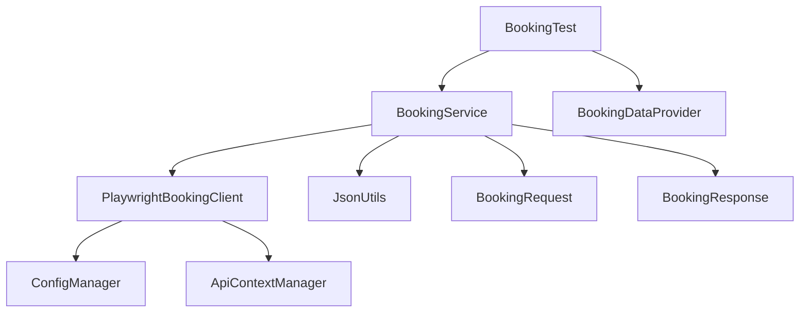

# Test automation framework for API automation built on top of Playwright with Java

This test automation framework serves as a single framework to create both UI and API automated test cases.
Web Application Under Test - https://www.saucedemo.com/
API Application Under Test - https://api.instantwebtools.net//v1/airlines

## Architecture overview

## Component summary

- ConfigManager → configuration and base URL
- ApiContextManager → Playwright API context lifecycle
- PlaywrightBookingClient → HTTP communication
- BookingService → booking workflow orchestration
- BookingRequest/BookingResponse → DTOs
- BookingDataProvider → test data generation
- JsonUtils → serialization/deserialization
- BookingTest → assertions and test execution